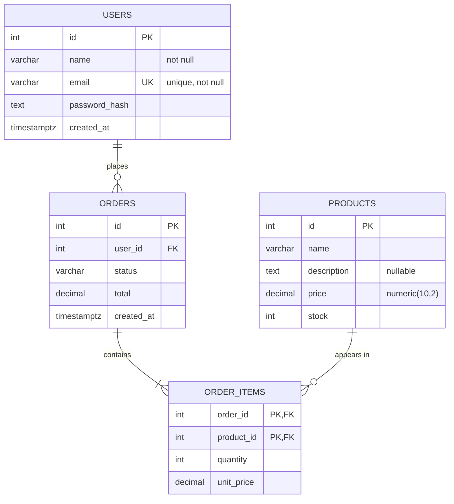

# Entity-relationship model (fixture: matches schema_ok.sql)

```mermaid
erDiagram
    %% relationships
    USERS ||--o{ ORDERS : places
    ORDERS ||--|{ ORDER_ITEMS : contains
    PRODUCTS ||--o{ ORDER_ITEMS : "appears in"

    USERS {
        int id PK
        varchar name "not null"
        varchar email UK "unique, not null"
        text password_hash
        timestamptz created_at
    }
    PRODUCTS {
        int id PK
        varchar name
        text description "nullable"
        decimal price "numeric(10,2)"
        int stock
    }
    ORDERS {
        int id PK
        int user_id FK
        varchar status
        decimal total
        timestamptz created_at
    }
    ORDER_ITEMS {
        int order_id PK, FK
        int product_id PK, FK
        int quantity
        decimal unit_price
    }
```

Each entity is a table of the schema.
