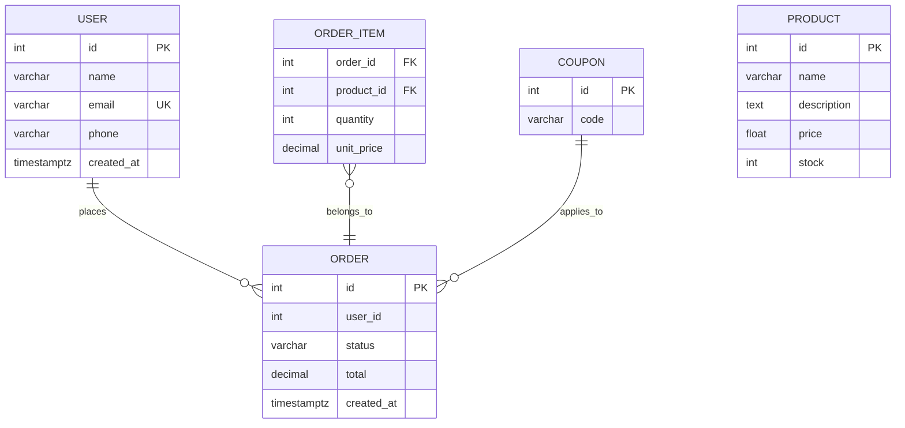

# Entity-relationship model (fixture: does NOT match schema_ok.sql)

```mermaid
erDiagram
    USER ||--o{ ORDER : places
    ORDER_ITEM }o--|| ORDER : belongs_to
    COUPON ||--o{ ORDER : applies_to

    USER {
        int id PK
        varchar name
        varchar email UK
        varchar phone
        timestamptz created_at
    }
    PRODUCT {
        int id PK
        varchar name
        text description
        float price
        int stock
    }
    ORDER {
        int id PK
        int user_id
        varchar status
        decimal total
        timestamptz created_at
    }
    ORDER_ITEM {
        int order_id FK
        int product_id FK
        int quantity
        decimal unit_price
    }
    COUPON {
        int id PK
        varchar code
    }
```
